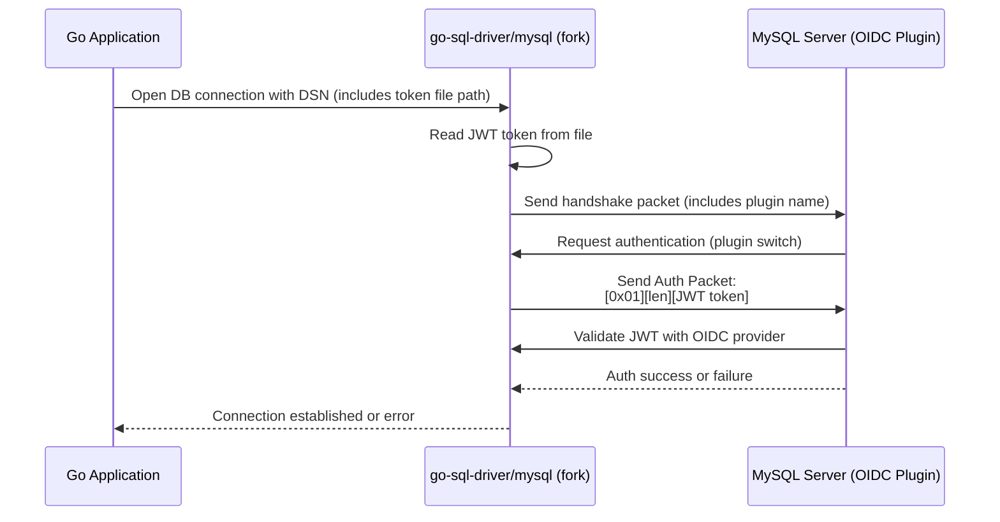

# MySQL Go Driver: JWT Authentication Support for OpenID Connect Plugin

## Introduction
This project is a fork of [go-sql-driver/mysql](https://github.com/go-sql-driver/mysql), enhanced to support authentication with a JWT token using the MySQL OpenID Connect Pluggable Authentication plugin.

The main goal of this fork is to enable Go applications to connect securely to MySQL databases configured with OIDC authentication, by sending a JWT token as part of the authentication handshake, in compliance with the MySQL protocol.

This documentation describes the protocol, the required code modifications, and how to use the new features in your Go applications.


Legend:

- [0x01][len][JWT token] = capability flag, length-encoded JWT token (see protocol)
- The driver reads the JWT from the file, builds the correct packet, and sends it as required by the MySQL OIDC plugin.

## Protocol Reference

According to the [MySQL documentation](https://dev.mysql.com/doc/dev/mysql-server/latest/page_protocol_connection_phase_packets_protocol_handshake_response.html),  
the client must send an authentication packet with the following format for OpenID Connect:

- **1 byte:** Capability flag (currently always `0x01`)
- **Length-encoded string:** The JWT ID token

**Packet structure:**
```
[Capability flag][Length of Length][Length of ID token][ID token]
```
The length-encoded string format is described here:  
https://dev.mysql.com/doc/dev/mysql-server/latest/page_protocol_basic_dt_strings.html#sect_protocol_basic_dt_string_le

---

## Summary of Required Modifications

### 1. DSN Parsing

- Parse the DSN for OIDC parameters:
  - `auth_client_plugin`
  - `authentication_openid_connect_client_id_token_file`
- Store them in the config for use during handshake.

---

### 2. `packets.go`: Add/Modify `writeLengthEncodedString`

```go
// writeLengthEncodedString writes a string in MySQL's Length-Encoded String format.
func writeLengthEncodedString(buf *bytes.Buffer, b []byte) {
    n := len(b)
    switch {
    case n < 251:
        buf.WriteByte(byte(n))
    case n < 0x10000:
        buf.WriteByte(0xfc)
        buf.WriteByte(byte(n))
        buf.WriteByte(byte(n >> 8))
    case n < 0x1000000:
        buf.WriteByte(0xfd)
        buf.WriteByte(byte(n))
        buf.WriteByte(byte(n >> 8))
        buf.WriteByte(byte(n >> 16))
    default:
        buf.WriteByte(0xfe)
        for i := 0; i < 8; i++ {
            buf.WriteByte(byte(n >> (8 * i)))
        }
    }
    buf.Write(b)
}
```

---

### 3. `packets.go`: Modify `writeHandshakeResponsePacket`

```go
if authPlugin == "authentication_openid_connect" || authPlugin == "authentication_openid_connect_client" {
    tokenFilePath, ok := mc.cfg.Params["authentication_openid_connect_client_id_token_file"]
    if !ok || tokenFilePath == "" {
        return fmt.Errorf("OIDC plugin selected but no JWT token file provided")
    }
    jwtBytes, err := os.ReadFile(tokenFilePath)
    if err != nil {
        return fmt.Errorf("failed to read JWT token file: %v", err)
    }
    jwtToken := strings.TrimSpace(string(jwtBytes))
    var buf bytes.Buffer
    buf.WriteByte(0x01) // Capability flag
    writeLengthEncodedString(&buf, []byte(jwtToken))
    authResp = buf.Bytes()
}
```

---

### 4. `connection.go`: Exclude OIDC Params from SQL

```go
for param, val := range mc.cfg.Params {
    if param == "auth_client_plugin" || param == "authentication_openid_connect_client_id_token_file" {
        continue // skip OIDC params
    }
    // ...existing code...
}
```

---

### 5. `auth.go`: Support OIDC Plugin in Auth Logic

#### In `auth()`:

```go
case "authentication_openid_connect_client":
    token, ok := mc.cfg.Params["authentication_openid_connect_client_id_token_file"]
    if !ok || token == "" {
        return nil, fmt.Errorf("OIDC token not provided")
    }
    return []byte(token), nil
```

#### In `handleAuthResult()`:

```go
case "authentication_openid_connect":
    token, ok := mc.cfg.Params["authentication_openid_connect_client_id_token_file"]
    if !ok {
        return errors.New("missing required param 'authentication_openid_connect_client_id_token_file'")
    }
    var packet []byte
    packet = append(packet, byte(1)) // capability bit
    packet = appendLengthEncodedInteger(packet, uint64(len(token)))
    packet = append(packet, []byte(token)...)
    if err := mc.writePacket(packet); err != nil {
        return fmt.Errorf("failed to send OIDC token with capability: %w", err)
    }
    return mc.resultUnchanged().readResultOK()
```

---

## Requirements

Go 1.22 or higher. 
MySQL Enterprise 9.1 or higer (for support OpenID Connect Plugin)
MySQL enterprise OpenID Connect Pluggable Authentication plugin

## Installation

Simple install the package to your [$GOPATH](https://github.com/golang/go/wiki/GOPATH) with the [go tool](https://golang.org/cmd/go/) from shell:

```bash
go get -u github.com/colussim/mysql-auth-oidc-go
```

Make sure [Git is installed ](https://git-scm.com/downloads)on your machine and in your system's PATH.

---

## Usage

This fork is a drop-in replacement of the original [Go MySQL Driver](https://github.com/go-sql-driver/mysql), with added support for JWT-based authentication using the MySQL OpenID Connect Pluggable Authentication plugin.

It implements Go's `database/sql/driver` interface. Simply import the driver and use it as usual with the `database/sql` package:

```go
import (
    "database/sql"
    _ "github.com/colussim/mysql-auth-oidc-go"
)

db, err := sql.Open("mysql", "<DSN>")
```


To use JWT authentication with the MySQL OpenID Connect plugin in your Go application:

### 1. **Generate or Obtain a JWT Token**

Obtain a valid JWT token from your OIDC provider and save it to a file (for example: `/tmp/mysql_token.txt`).

### 2. **Build the DSN**

Add the following parameters to your MySQL DSN:

- `auth_client_plugin=authentication_openid_connect_client`
- `authentication_openid_connect_client_id_token_file=/path/to/your/token.txt`

**Example DSN:**
```
mysql_app@tcp(mysql.demos.com:3306)/identity_demo?tls=custom&allowCleartextPasswords=1&auth_client_plugin=authentication_openid_connect_client&authentication_openid_connect_client_id_token_file=/tmp/mysql_token.txt
```

### 3. **Open the Database Connection**

In your Go code, use the DSN as usual with `sql.Open`:

```go
escapedTokenFilePath :=url.QueryEscape("/tmp/mysql_token.txt")
dsn := fmt.Sprintf("%s@tcp(%s)/%s?tls=custom&allowCleartextPasswords=1&auth_client_plugin=authentication_openid_connect_client&authentication_openid_connect_client_id_token_file=%s",
    "mysql_app",
    "mysql.demos.com:3306",
    "identity_demo",
    escapedTokenFilePath,
)
db, err := sql.Open("mysql", dsn)
if err != nil {
    log.Fatalf("Failed to connect: %v", err)
}
defer db.Close()
```

### 4. **Authentication Flow**

- The driver will read the JWT token from the file specified by `authentication_openid_connect_client_id_token_file`.
- The token will be sent to MySQL as part of the authentication handshake, following the OpenID Connect plugin protocol.

---

## Rationale

- The JWT token is securely read from a file at connection time.
- The handshake and authentication packets are constructed according to the MySQL OIDC protocol.
- OIDC-specific DSN parameters are not sent as SQL, but only used for authentication.

---

**With these modifications, the Go MySQL driver can authenticate using a JWT token with the MySQL OpenID Connect plugin.**
